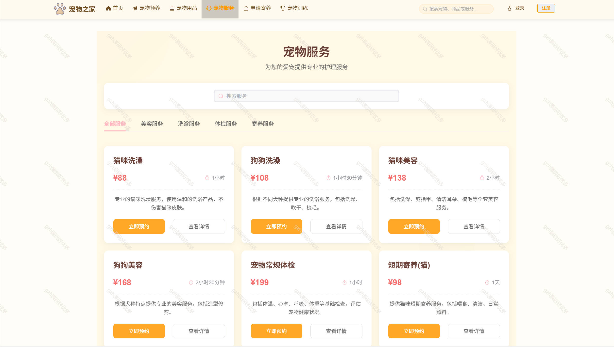

# springbootA531
springbootA531宠物之家管理系统（Vue3）
 
## 查看主页获取源码

### 一、关键词
宠物之家管理系统，宠物系统

### 二、作品包含
源码+数据库+全套环境和工具资源+本地部署教程

### 三、项目技术
前端技术：Html、Css、Js、Vue3.0、Element-plus 
后端技术：Java、SpringBoot3.0、MyBatis

### 四、运行环境（以下版本亲测，其他版本未知，请自测）
开发工具：IDEA/eclipse  + VSCODE

数据库：MySQL8

数据库管理工具：Navicat10以上版本

环境配置软件： JDK17 + Maven3.6.3

前端Nodejs：18

浏览器：谷歌浏览器

### 五、项目介绍
项目编号：springbootA531

1.本系统是一个基于SpringBoot3和Vue3开发的宠物服务平台，主要提供宠物领养、寄养、用品购买、宠物服务、宠物训练等功能。

2. 用户角色划分
2.1 游客
浏览宠物信息
浏览商品信息
注册账号
2.2 普通用户
宠物领养申请
宠物寄养预约
购买宠物用品
预约宠物服务
订单管理
个人信息管理
2.3 管理员
用户管理
宠物信息管理
商品管理
订单管理
服务管理
系统维护
3. 功能模块设计
3.1 用户模块
登录注册
个人信息修改
密码修改
角色权限管理
3.2 宠物领养模块
宠物信息展示
领养申请
领养进度查询
领养记录管理
3.3 宠物寄养模块
寄养服务展示
寄养预约
寄养状态查询
寄养记录管理
3.4 宠物用品模块
商品分类展示
商品搜索
购物车
订单管理
支付功能
3.5 宠物服务模块
服务类型展示（美容、洗澡、体检等）
服务预约
服务评价
服务记录管理
3.6 宠物训练模块
训练课程展示
训练课程预约
训练进度跟踪
训练评价管理
3.8 首页轮播图模块
轮播图管理
公告展示
3.10 系统管理模块
菜单管理
角色权限管理

系统公告管理

数据字典管理
3.11 宠物健康记录模块
宠物体检记录
疫苗接种记录

### 六、运行截图

